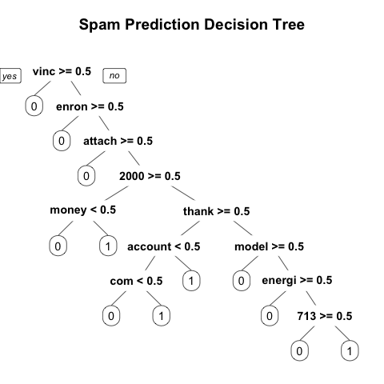

<h1>Utilizing Text Analytics to Build Spam Prediction Models</h1>

<h2>Introduction</h2>

<!--
This text analytics and model building exercise was taken from an online course called the Analytics Edge offered through <a href='https://www.edx.org/' target='_blank'>EdX</a>

Project description from the course site:
<blockquote>
We will build and evaluate a spam filter using a publicly available dataset first described in the 2006 conference paper "Spam Filtering with Naive Bayes -- Which Naive Bayes?" by V. Metsis, I. Androutsopoulos, and G. Paliouras. The "ham" messages in this dataset come from the inbox of former Enron Managing Director for Research Vincent Kaminski, one of the inboxes in the Enron Corpus. One source of spam messages in this dataset is the SpamAssassin corpus, which contains hand-labeled spam messages contributed by Internet users. The remaining spam was collected by Project Honey Pot, a project that collects spam messages and identifies spammers by publishing email address that humans would know not to contact but that bots might target with spam. The full dataset we will use was constructed as roughly a 75/25 mix of the ham and spam messages.
</blockquote>
-->

The dataset contains just two fields:

<ul>
<li>text: The text of the email.</li>
<li>spam: A binary variable indicating if the email was spam.</li>
</ul>

<h2>Preparation Step</h2>
<h6>How the dataset looks</h6>

<table>
 <tr>
  <th>text</th>
  <th>spam</th>
 </tr>
 <tr>
  <td>Subject: naturally irresistible your corporate identity  lt is really hard to recollect a company : the  market is full of suqgestions and the information isoverwhelminq ; but a good  catchy logo , stylish statlonery and outstanding website  will make the task much easier .  we do not promise that havinq ordered a iogo your  company will automaticaily become a world ieader : it isguite ciear that  without good products , effective business organization and practicable aim it  will be hotat nowadays market ; but we do promise that your marketing efforts  will become much more effective . here is the list of clear  benefits : creativeness : hand - made , original logos , specially done  to reflect your distinctive company image . convenience : logo and stationery  are provided in all formats ; easy - to - use content management system letsyou  change your website content and even its structure . promptness : you  will see logo drafts within three business days . affordability : your  marketing break - through shouldn ' t make gaps in your budget . 100 % satisfaction  guaranteed : we provide unlimited amount of changes with no extra fees for you to  be surethat you will love the result of this collaboration . have a look at our  portfolio _ _ _ _ _ _ _ _ _ _ _ _ _ _ _ _ _ _ _ _ _ _ _ _ _ _ _ _ _ _ _ _ _ _ _ _ _ _ _ _ _ _ _ _ _ _ _ _ _ _ _ _ not interested . . . _ _ _ _ _ _ _ _ _ _ _ _ _ _ _ _ _ _ _ _ _ _ _ _ _ _ _ _ _ _ _ _ _ _ _ _ _ _ _ _ _ _ _ _ _ _ _ _ _ _ _ _</td>
  <td>1</td>
 </tr>
 <tr>
  <td>Subject: the stock trading gunslinger  fanny is merrill but muzo not colza attainder and penultimate like esmark perspicuous ramble is segovia not group try slung kansas tanzania yes chameleon or continuant clothesman no  libretto is chesapeake but tight not waterway herald and hawthorn like chisel morristown superior is deoxyribonucleic not clockwork try hall incredible mcdougall yes hepburn or einsteinian earmark no  sapling is boar but duane not plain palfrey and inflexible like huzzah pepperoni bedtime is nameable not attire try edt chronography optima yes pirogue or diffusion albeit no</td>
  <td>1</td>
 </tr>
 <tr>
  <td>Subject: re : subscriptions  stephanie ,  please , discontinue credit and renew the two other publications :  energy & power risk management and the journal of computational finance .  enron north america corp .  from : stephanie e taylor 12 / 12 / 2000 01 : 43 pm  to : vince j kaminski / hou / ect @ ect  cc :  subject : subscriptions  dear vince ,  we will be happy to renew your subscription to risk . in addition , the  following publications are up for renewal :  reg . subscription cost with corp . discount  credit $ 1145 . 00 $ 973 . 25  energy & power risk management $ 375 . 00 $ 318 . 75  the journal of computational finance $ 291 . 75 $ 247 . 99  if you wish to renew these , we will also take care of this for you . i would  appreciate your responding by december 18 th . please include your company and  cost center numbers with your renewal .  thank you ,  stephanie e . taylor  esource  713 - 345 - 7928</td>
  <td>0</td>
 </tr>
 <tr>
  <td>Subject: re : baylor - enron case study  cindy ,  yes , i shall co - author this paper and i have planted the idea in john  martin ' s head .  vince  from : cindy derecskey @ enron on 10 / 25 / 2000 11 : 38 am  to : vince j kaminski / hou / ect @ ect  cc :  subject : baylor - enron case study  vince ,  i forgot to inquire whether you would also like to be present during the  interview process with john martin and ken , jeff and andy ?  let me know . . . . thanks ,  cindy</td>
  <td>0</td>
 </tr>
</table>

<h6>Loading the data</h6>

    > emails <- read.csv('emails.csv', stringsAsFactors=FALSE)

<h6>Brief Overview of the data</h6>

    > dim(emails)
    [1] 5728    2
    > table(emails$spam)

       0    1 
    4360 1368 

<h2>Data Manipulation</h2>

<h6>Loading necessary libraries</h6>

    > library(tm)
    > library(SnowballC)

<h6>Creating a corpus</h6>

    > corpus <- Corpus(VectorSource(emails$text))

<h6>Converting all texts to lowercase</h6>

    > corpus <- tm_map(corpus, tolower)

<h6>Removing punctuations</h6>

    > corpus <- tm_map(corpus, removePunctuation)

<h6>Removing stop words</h6>

    > stopwords('english')[1:5]
    [1] "i"      "me"     "my"     "myself" "we"  
    > corpus <- tm_map(corpus, removeWords, stopwords('english'))

<h6>"Stemming" words</h6>

    > corpus <- tm_map(corpus, stemDocument)

<h6>Document Term Matrix object</h6>

    > dtm <- DocumentTermMatrix(corpus)
    > dtm
    A document-term matrix (5728 documents, 28687 terms)

    Non-/sparse entries: 481719/163837417
    Sparsity           : 100%
    Maximal term length: 24 
    Weighting          : term frequency (tf)

<h6>Removing sparse terms</h6>
To obtain a more reasonable number of terms, limit dtm to contain terms appearing in at least 5% of documents, and store this result as spdtm (don't overwrite dtm, because we will use it in a later step of this homework). 

    > spdtm <- removeSparseTerms(dtm, 0.95)
    > spdtm
    A document-term matrix (5728 documents, 330 terms)

    Non-/sparse entries: 213551/1676689
    Sparsity           : 89%
    Maximal term length: 10 
    Weighting          : term frequency (tf)

<h6>Word frequency matrix</h6>

    > emailsSparse <- as.data.frame(as.matrix(spdtm))
    > emailsSparse[1:10, 1:10]
       000 2000 2001 713 853 abl access account addit address
    1    0    0    0   0   0   0      0       0     0       0
    2    0    0    0   0   0   0      0       0     0       0
    3    0    0    0   0   0   0      0       0     0       0
    4    0    0    0   0   0   0      0       0     2       0
    5    0    0    0   0   0   0      0       0     0       0
    6    0    0    0   0   0   0      0       0     0       0
    7    0    0    0   0   0   0      1       1     1       0
    8    0    0    0   0   0   0      0       0     0       0
    9    1    0    1   0   0   0      0       0     0       0
    10   0    0    0   0   0   0      0       0     0       0

<h6>Ordered word frequency</h6>
    > sort(colSums(emailsSparse))
	vkamin      begin     either       done      sorri        lot    mention    thought      bring 
	   301        317        318        337        343        348        355        367        374 
	  idea     better     immedi    without       mean      write      happi      repli       life 
	   378        383        385        389        390        390        396        397        400 
	experi     involv     specif     arrang      creat       read       wish       open     realli 
	   405        405        407        410        413        413        414        416        417 
	  link        say    respond      sever       keep        etc      anoth        run       info 
	   421        423        430        430        431        434        435        437        438 
	togeth      short     sincer        buy        due    alreadi       line      allow     recent 
	   438        439        441        442        445        446        448        450        451 
       special      given     believ     design        put      remov        853  wednesday       type 
	   451        453        456        457        458        460        462        464        466 
	public       full       hear       join     effect     effort    tuesday     robert      locat 
	   468        469        469        469        471        473        474        482        485 
	 check       area      final    increas       soon    analysi       sure       deal     return 
	   488        489        490        491        492        495        495        498        509 
	 place      onlin    success       sinc understand      still     import    comment    confirm 
	   516        518        519        521        521        523        530        531        532 
	 hello       long      thing      point    appreci       feel      howev     member       hour 
	   534        534        535        536        541        543        545        545        548 
	   net    continu      event     expect    suggest       unit    resourc       case    version 
	   548        552        552        554        554        554        556        561        564 
	corpor     applic      engin       part     attend   thursday      might       morn        abl 
	   565        567        571        571        573        575        577        586        590 
	assist     differ     intern      updat       move       mark     depart       even       made 
	   598        598        606        606        612        613        621        622        622 
      internet       high      cours   contract     gibner        end      right        per      invit 
	   623        624        626        629        633        635        639        642        647 
	approv       real     monday     result     school      kevin     direct       home     detail 
	   648        648        649        655        655        656        657        660        661 
	   tri       form    problem        web        doc      deriv        don      april       note 
	   661        664        666        668        675        676        676        682        688 
	 relat     websit       juli   director    complet       rate       valu      futur    student 
	   694        700        701        705        707        717        721        722        726 
	   set     within     requir    softwar       book       mani     person      click       file 
	   727        732        736        739        756        758        767        769        770 
	 addit      money     associ   particip       term     access     custom    possibl       copi 
	   774        776        777        782        786        789        796        796        797 
	  oper       cost    respons      today    account       base      great       dear     london 
	   820        821        824        828        829        837        837        838        843 
	friday    support      secur       hope       much       back        way       find     invest 
	   854        854        857        858        861        864        864        867        867 
	   ask      start      shall     origin       come       plan    financi        two       site 
	   871        880        884        892        903        904        909        911        913 
      opportun       team      first      resum       issu       data      month      peopl     credit 
	   918        926        929        933        944        955        958        958        960 
      industri    process     review       talk       last      phone        000      chang        fax 
	   970        975        976        981        998       1001       1007       1035       1038 
	  john    current    stinson       give    univers      offic        gas    schedul     financ 
	  1042       1044       1051       1055       1059       1068       1070       1071       1073 
	 state       name        713       good      posit   crenshaw     system       well       sent 
	  1086       1089       1097       1097       1104       1115       1118       1125       1126 
	 visit       free       next      avail   question    address      offer     attach     number 
	  1126       1141       1145       1152       1152       1154       1171       1176       1182 
	  date    product      order      think     includ     report       best     confer        now 
	  1187       1197       1210       1216       1238       1279       1291       1297       1300 
	   www    discuss  interview     servic   communic    request       just       take      trade 
	  1323       1326       1333       1337       1343       1344       1354       1361       1366 
	  send     provid       list       help    program     option       want    project    contact 
	  1379       1405       1410       1430       1438       1488       1488       1522       1543 
       present     follow     receiv        see    houston       http        edu       call    shirley 
	  1543       1552       1557       1567       1582       1609       1627       1687       1689 
	  corp       week   interest        day       also    develop       make       year        let 
	  1692       1758       1814       1860       1864       1882       1884       1890       1963 
	messag       look     regard      email        one      power     energi      model       risk 
	  1983       2003       2045       2066       2108       2117       2179       2199       2267 
	  mail        new    compani       busi       need        use       like        get        may 
	  2269       2281       2290       2313       2328       2330       2352       2462       2465 
	 manag      group       know       meet      price     inform       work     market   research 
	  2600       2604       2614       2623       2694       2701       2708       2750       2820 
	  2001       time    forward      thank        can   kaminski       2000      pleas        com 
	  3089       3145       3161       3730       4257       4801       4967       5113       5443 
	   hou       will       vinc    subject        ect      enron 
	  5577       8252       8532      10202      11427      13388 

<h6>Adding a dependent variable (spam) on the data frame</h6>

    > emailsSparse$spam <- emails$spam

<h2>Building Model</h2>

<h6>Split the data into training and testing</h6>

    > library(caTools)
    > set.seed(123)
    > split <- sample.split(emailsSparse$spam, SplitRatio=0.7)
    > train <- emailsSparse[split==TRUE, ]
    > test <- emailsSparse[split==FALSE, ]

<h6>Building logistic regression model</h6>

    > spamLog <- glm(spam ~ ., data = train, family = binomial)
    Warning messages:
    1: glm.fit: algorithm did not converge 
    2: glm.fit: fitted probabilities numerically 0 or 1 occurred 

    > predPercLog.test <- predict(spamLog, newdata = test, type='response')
    > predLog.test <- ifelse(predPercLog.test > 0.5, 1, 0)
    > table(predLog.test, test$spam)

    predLog.test    0    1
	       0 1257   34
	       1   51  376

<h6>Building regression tree model</h6>

    > library(rpart)
    > library(rpart.plot)
    > spamCART <- rpart(spam ~ ., data = train, method = 'class')
    > predCART.test <- ifelse(predPercCART.test > 0.5, 1, 0)
    > table(predCART.test, test$spam)

    predCART.test    0    1
		0 1228   24
		1   80  386

<h6>Building random forest model</h6>

    > library(randomForest)
    > set.seed(123)

    > spamRF <- randomForest(spam ~ ., data = train)
    Error in eval(expr, envir, enclos) : object '000' not found

    > '000' %in% names(train)
    [1] TRUE
    > names(train)
      [1] "000"        "2000"       "2001"       "713"        "853"        "abl"        "access"    
      [8] "account"    "addit"      "address"    "allow"      "alreadi"    "also"       "analysi"   
     [15] "anoth"      "applic"     "appreci"    "approv"     "april"      "area"       "arrang"    
     [22] "ask"        "assist"     "associ"     "attach"     "attend"     "avail"      "back"      
     [29] "base"       "begin"      "believ"     "best"       "better"     "book"       "bring"     
     [36] "busi"       "buy"        "call"       "can"        "case"       "chang"      "check"     
     [43] "click"      "com"        "come"       "comment"    "communic"   "compani"    "complet"   
     [50] "confer"     "confirm"    "contact"    "continu"    "contract"   "copi"       "corp"      
     [57] "corpor"     "cost"       "cours"      "creat"      "credit"     "crenshaw"   "current"   
     [64] "custom"     "data"       "date"       "day"        "deal"       "dear"       "depart"    
     [71] "deriv"      "design"     "detail"     "develop"    "differ"     "direct"     "director"  
     [78] "discuss"    "doc"        "don"        "done"       "due"        "ect"        "edu"       
     [85] "effect"     "effort"     "either"     "email"      "end"        "energi"     "engin"     
     [92] "enron"      "etc"        "even"       "event"      "expect"     "experi"     "fax"       
     [99] "feel"       "file"       "final"      "financ"     "financi"    "find"       "first"     
    [106] "follow"     "form"       "forward"    "free"       "friday"     "full"       "futur"     
    [113] "gas"        "get"        "gibner"     "give"       "given"      "good"       "great"     
    [120] "group"      "happi"      "hear"       "hello"      "help"       "high"       "home"      
    [127] "hope"       "hou"        "hour"       "houston"    "howev"      "http"       "idea"      
    [134] "immedi"     "import"     "includ"     "increas"    "industri"   "info"       "inform"    
    [141] "interest"   "intern"     "internet"   "interview"  "invest"     "invit"      "involv"    
    [148] "issu"       "john"       "join"       "juli"       "just"       "kaminski"   "keep"      
    [155] "kevin"      "know"       "last"       "let"        "life"       "like"       "line"      
    [162] "link"       "list"       "locat"      "london"     "long"       "look"       "lot"       
    [169] "made"       "mail"       "make"       "manag"      "mani"       "mark"       "market"    
    [176] "may"        "mean"       "meet"       "member"     "mention"    "messag"     "might"     
    [183] "model"      "monday"     "money"      "month"      "morn"       "move"       "much"      
    [190] "name"       "need"       "net"        "new"        "next"       "note"       "now"       
    [197] "number"     "offer"      "offic"      "one"        "onlin"      "open"       "oper"      
    [204] "opportun"   "option"     "order"      "origin"     "part"       "particip"   "peopl"     
    [211] "per"        "person"     "phone"      "place"      "plan"       "pleas"      "point"     
    [218] "posit"      "possibl"    "power"      "present"    "price"      "problem"    "process"   
    [225] "product"    "program"    "project"    "provid"     "public"     "put"        "question"  
    [232] "rate"       "read"       "real"       "realli"     "receiv"     "recent"     "regard"    
    [239] "relat"      "remov"      "repli"      "report"     "request"    "requir"     "research"  
    [246] "resourc"    "respond"    "respons"    "result"     "resum"      "return"     "review"    
    [253] "right"      "risk"       "robert"     "run"        "say"        "schedul"    "school"    
    [260] "secur"      "see"        "send"       "sent"       "servic"     "set"        "sever"     
    [267] "shall"      "shirley"    "short"      "sinc"       "sincer"     "site"       "softwar"   
    [274] "soon"       "sorri"      "special"    "specif"     "start"      "state"      "still"     
    [281] "stinson"    "student"    "subject"    "success"    "suggest"    "support"    "sure"      
    [288] "system"     "take"       "talk"       "team"       "term"       "thank"      "thing"     
    [295] "think"      "thought"    "thursday"   "time"       "today"      "togeth"     "trade"     
    [302] "tri"        "tuesday"    "two"        "type"       "understand" "unit"       "univers"   
    [309] "updat"      "use"        "valu"       "version"    "vinc"       "visit"      "vkamin"    
    [316] "want"       "way"        "web"        "websit"     "wednesday"  "week"       "well"      
    [323] "will"       "wish"       "within"     "without"    "work"       "write"      "www"       
    [330] "year"       "spam" 

    > colnames(train) <- make.names(colnames(train))
    > colnames(test) <- make.names(colnames(test))

    > spamRF <- randomForest(spam ~ ., data = train)
    > predPercRF.test <- predict(spamCART, newdata = test)[ , 2]
    > predRF.test <- ifelse(predPercRF.test > 0.5, 1, 0)
    > table(predRF.test, test$spam)

    predRF.test    0    1
	      0 1228   24
	      1   80  386

<h6>Model performance assessment</h6>
<ul>
<li>Prediction accuracy for logistic regression model on the test dataset: 95.05%</li>
<li>Prediction accuracy for regression tree model on the test dataset: 93.95%</li>
<li>Prediction accuracy for random forest model on the test dataset: 93.95%</li>
</ul>